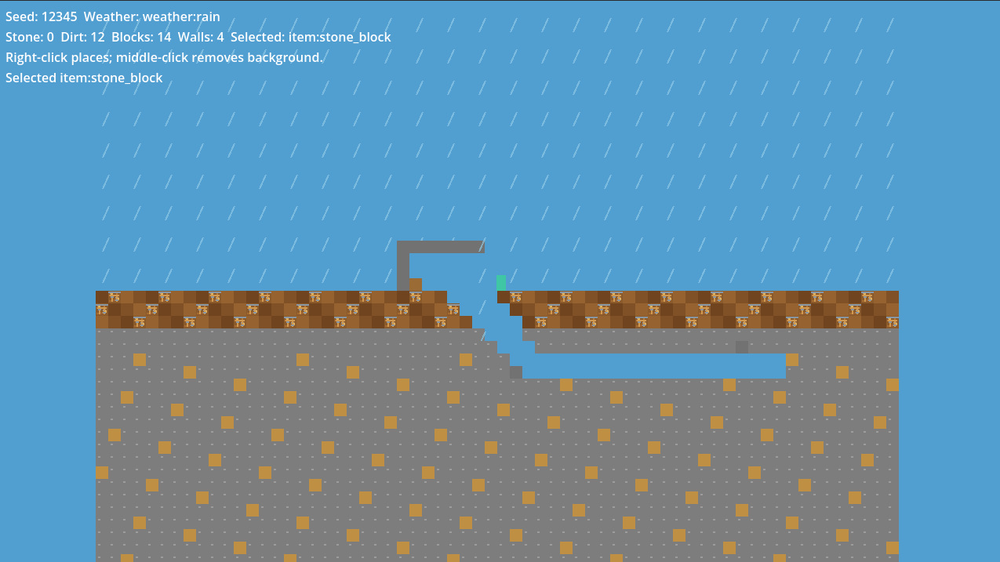

# Godot 2D Sandbox Starter

An AI-friendly reusable GitHub template for finite, side-view, tile-based 2D sandbox games. It proves a small vertical slice: deterministic terrain, character movement, mining, building, inventory, station-gated crafting, versioned saves, weather presentation, and an authoritative loopback multiplayer mutation.

It is an engineering foundation, not a finished game or content pack. All tile visuals and content (`dirt`, `stone`, `ore`, and `workbench`) are deliberately generic placeholders. This repository deliberately does not include combat, enemies, quests, a technology tree, lore, production artwork, or online-service infrastructure.



## Quick start

```text
just bootstrap
just check
just run
```

Requirements are Godot **4.7.1 stable** (standard GDScript build), `uv`, and `just`. Set `GODOT_BIN` if Godot is not on PATH. `just bootstrap` installs the locked Python developer tools and the SHA-256-verified GUT dependency declared by `dependencies.json`.

## Playable slice controls

| Input | Action |
| --- | --- |
| A / D | Move left / right |
| Space | Jump |
| Left mouse | Mine a nearby tile |
| Right mouse | Place the selected placeable item |
| Middle mouse | Remove a nearby background wall |
| C | Craft a stone block when beside a workbench |
| Q | Cycle the selected placeable inventory item |
| K / L | Save / load `user://sandbox-save.json` |

The initial weather is rain so the boundary is visible. `Q` cycles placeable items currently held. Workbenches and crafted stone blocks can both be placed and recovered; natural stone remains raw stone when mined. Rain uses a simple vertical shelter rule: a solid tile above blocks it, so rain is visible outside but not beneath roofs or terrain. The HUD is only a view of the domain inventory and weather; it does not own any gameplay state.

`Q` also selects `item:stone_wall`; that item places a persistent non-colliding background wall, so it can share a cell with foreground terrain. Middle mouse deliberately removes only that background layer. `K` and `L` are deliberately ordinary keys so save/load works in Godot Editor embedded play mode. A successful save reports `Saved.` in the HUD and prints the resolved path for `user://sandbox-save.json` to Godot's output; use that path to inspect or deliberately corrupt a save before testing the load error message.

## Architecture

`src/domain/` contains `RefCounted` state and deterministic rules independent of the scene tree: the finite chunk-aware, two-layer `WorldState`, tile definitions, inventory, recipes, and weather. `src/game/` contains the host-authoritative actions. `src/presentation/` draws state and accepts input; it is never the authority. `src/persistence/` encodes an inspectable JSON save with an explicit format version. Pixel size is centralized in `WorldConfig.TILE_SIZE_PIXELS` (16), while world/chunk coordinates remain integer tile coordinates.

Presentation is project-owned data: `assets/tiles/placeholder_tiles.svg`, `resources/tiles/sandbox_tileset.tres`, and `resources/tiles/tile_presentations.tres`. The catalog maps semantic IDs to TileSet cells, then deterministically selects cosmetic variants from world seed, tile coordinate, semantic ID, and stable world-layer ID. Variants are not saved or networked; equivalent worlds reconstruct them locally. The bundled art is 16×16 placeholder content only. Derived projects may intentionally change tile size later through the centralized configuration and presentation pipeline rather than changing gameplay IDs.

Background walls are persistent buildable sandbox cells behind foreground terrain; they are not scenic sky/cloud/dune backgrounds and have no physics or rain-shelter meaning. Scenic/parallax presentation remains a future presentation-only system.

When adding a new semantic tile and atlas/TileSet mapping, define its semantic tile first, configure every visual variant, then configure each TileSet cell's physics to match semantic solidity and run `just check`. Catalog validation rejects a solid variant without effective collision and a non-solid variant with collision; background walls are always non-solid.

World generation uses the explicit seed, configuration, and a versioned deterministic generator. Chunk coordinates are a storage concern now and a future render/persistence/network partition seam; no streaming system is implied. See [docs/architecture.md](docs/architecture.md) and the ADRs for the fuller rationale.

## Commands

| Command | Purpose |
| --- | --- |
| `just format` / `just format-check` | Format or check first-party Python and GDScript. |
| `just lint` | Run Ruff and gdtoolkit linting. |
| `just test` | Run Pytest and GUT unit, integration, and simulation tests. |
| `just network-smoke` | Start headless host and client processes using real local ENet transport, then prove a client intent is host-validated and replicated. |
| `just check` | Standard local gate: formatting, lint, tests, import, scene smoke, and network smoke. |
| `just export-windows` | Create an ignored Windows debug export. |

`just check` is expected before a PR; CI runs the same checks and a Windows export. The network smoke is intentionally small: it tests two real Godot processes, ENet transport, and a representative tile mutation, not matchmaking or Internet deployment.

## Template use

Use GitHub's **Use this template** action, keep the stable IDs in save/network contracts, and replace placeholder presentation in a derived game. Add game-specific content outside this template's generic domain rules. Read [AGENTS.md](AGENTS.md) and [CONTRIBUTING.md](CONTRIBUTING.md) before assigning changes to an agent.
